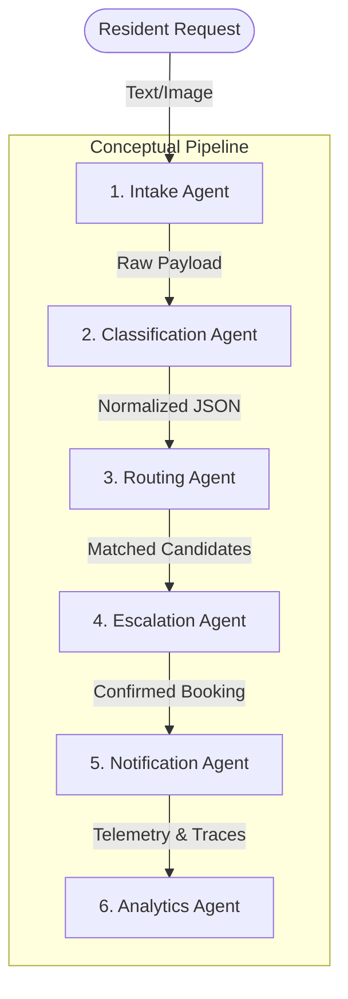

# 🤖 AetherFlow AI — Multi-Agent Workflow Specification

*Last Updated: 2026-07-02*

**Version:** 2.0 Final | **Team:** Team Scaller AI  
**Challenge:** Challenge 2: AI Service Orchestrator for Informal Economy  

---

## 1. Executive Agent Architecture Overview

AetherFlow AI uses a sequential, multi-agent orchestration pipeline that translates highly informal, unstructured, and multilingual (Urdu, Roman Urdu, English) resident complaints into a highly organized, geocoded database record, culminating in an autonomous dispatch and tracking workflow.

The orchestrator guarantees **end-to-end autonomous fulfillment** using a hybrid paradigm:
- **Conceptual Agents:** Structured lifecycle blocks (Intake, Classification, Routing, Escalation, Notification, Analytics).
- **Physical implementation Agents:** Modular TypeScript classes loaded with Gemini 2.5 Flash and open-source spatial APIs.

---

## 2. Step-by-Step Agent Workflow & Technical Mapping

### Step 1: User ➔ Intake Agent
* **Conceptual Objective:** Securely capture raw multimodal user complaints (e.g. text logs + photo uploads) and capture real-time geographical hints.
* **Physical Implementation:** `VisionAgent.ts` + `RequestService.ts`
* **Execution Flow:**
  1. Resident inputs details via a text field (e.g., *"AC chalte chalte band ho gaya hai, bohot garm hai room"* or *"hamara bathroom leak kar raha hai gulberg block b main"*) and optionally uploads a photo of the damaged appliance.
  2. The **Intake Agent** receives this payload, formats the base64 image (if present), and starts a localized process.
  3. A robust `Promise.race()` lock enforces an 8-second global timeout, safeguarding the UI from long network delays.
  4. The request is persisted as a `pending` state in the `requests` table, generating a unique `request_id`.

### Step 2: Intake Agent ➔ Classification Agent
* **Conceptual Objective:** Parse, clean, and translate unstructured multilingual text and images into a rigid, typed schema.
* **Physical Implementation:** `IntentAgent.ts` (using Gemini 2.5 Flash structured schemas)
* **Execution Flow:**
  1. The **Classification Agent** receives the raw text and base64 image metadata.
  2. If an image is present, it uses Google's `gemini-2.5-flash` model with a strict `extractionSchema` (JSON) to detect the type of problem, object, damage severity, and recommended service category (e.g., `"Plumber"`, `"AC Repair"`, `"Electrician"`).
  3. **Linguistic Normalization:** The agent processes Roman Urdu phrases and Urdu script using an internal translation dictionary mapping slang words (e.g., *"bijli wala"* ➔ `"Electrician"`, *"mistri"* ➔ `"Mason"`, *"nalka"* ➔ `"Plumber"`).
  4. **Fallback Mechanism:** If the API is offline or returns an error, the agent invokes its custom dynamic regex NLP parser (`dynamicExtract()`) to search for key tokens, prepositions (e.g., *"near"*, *"in"*, *"at"*), and Urdu verb endings to extract service category, location coordinates, and urgency level.

### Step 3: Classification Agent ➔ Routing Agent
* **Conceptual Objective:** Determine exact physical coordinates from unstructured location text, and find suitable available service professionals.
* **Physical Implementation:** `LocationAgent.ts` (OSM Nominatim) + `ProviderAgent.ts` (Supabase Queries)
* **Execution Flow:**
  1. The **Routing Agent** receives the address details (`city`, `area`, `block`, `street`, `house_no`) from the Classification Agent.
  2. It geocodes the location through **LocationAgent** using a cascading priority query to OpenStreetMap's Nominatim API:
     * *Level 1:* Full Address (`House X, Street Y, Block Z, Area, City`)
     * *Level 2:* Block + Area + City (fallback)
     * *Level 3:* Area + City (fallback)
     * *Level 4:* City only (fallback)
     * *Level 5:* Default coordinates (Islamabad Capital Territory center)
  3. Coordinates are cached in-memory to prevent API throttling.
  4. Once coordinates are obtained, **ProviderAgent** queries the `providers` table for service professionals matching the extracted `service` category who are currently `available`.

### Step 4: Classification Agent ➔ Escalation Agent (Fulfillment Dispatcher)
* **Conceptual Objective:** Rank candidate technicians and safely execute transactional dispatching.
* **Physical Implementation:** `RankingAgent.ts` + `DiscoveryEngine.ts` + `BookingAgent.ts` + `AssignmentAgent.ts`
* **Execution Flow:**
  1. **Scoring Model:** Candidate technicians are fed into the **RankingAgent**, which calculates a multidimensional suitability score on a 100-point scale:
     * *Haversine Distance (40%):* Proximity between technician's home base and request coordinates.
     * *Rating (30%):* Direct historical performance score (1.00 to 5.00 stars).
     * *Experience (15%):* Number of years in field.
     * *Response Speed / Completed Jobs (15%):* Historical speed and job completion counts.
  2. **Escalation Rules:**
     * *Standard:* Assign the #1 ranked technician immediately.
     * *No Matches Found:* Trigger the `DiscoveryEngine`'s fallback procedure. The search radius is expanded from 5km to 15km. If still empty, it performs a global category scan and selects a top-rated standby technician to guarantee service delivery.
  3. **Transactional Write:** `BookingAgent` creates a new confirmed record in the `bookings` table under a strict one-request-one-booking constraint.
  4. `AssignmentAgent` updates the request status to `assigned` and sets the chosen `provider_id`.

### Step 5: Escalation Agent ➔ Notification Agent
* **Conceptual Objective:** Provide clear, real-time tracking updates, map navigation, and auditory/text commentary.
* **Physical Implementation:** `BookingService.ts` (OSM Routing Engine) + `NarratorService.ts` (AI Commentary Layer)
* **Execution Flow:**
  1. **Technician Travel Simulation:** Once a job is accepted, `BookingService` starts a simulation. It requests real road network routing waypoints from the OSRM (Open Source Routing Machine) API.
  2. If the routing API is unavailable, the simulation uses linear geodetic interpolation to safely guide the technician on the map.
  3. The simulation transitions through 6 detailed stages: `assigned` ➔ `accepted` ➔ `en_route` ➔ `arrived` ➔ `working` ➔ `completed`.
  4. The **Notification Agent** updates coordinates and ETA on the database every 3 seconds.
  5. The `NarratorService` monitors the trace logs and dynamically compiles friendly, human-like voice and text summaries (e.g. *"Our Classify Agent has identified your water leak as a plumbing issue, and Geocode Agent has locked your house coordinates. Good news! Plumber Hanzala has accepted the job and is en route! Expected arrival is in 7 minutes."*).

### Step 6: Notification Agent ➔ Analytics Agent
* **Conceptual Objective:** Log structural logs of agent activity for compliance, performance metrics, and post-booking analysis.
* **Physical Implementation:** `TraceAgent.ts` + `TraceService.ts`
* **Execution Flow:**
  1. Every single micro-action by an agent is caught, cleaned, and stored in the `traces` table.
  2. **Trace Deduplication:** To avoid clogging the database and UI, a 10-second sliding deduplication window intercepts identical logs.
  3. **Post-Booking Action:** When the job status changes to `completed`, the agent triggers the follow-up flow, inserting post-service survey prompts in the `followups` table.
  4. A final audit log is generated, detailing the orchestrator's decisions, API latencies, and execution path for complete transparency.

---

## 3. Data Schema Inter-agent State Flow

| Agent | Input State | Output State | Database Mutations |
|---|---|---|---|
| **Intake** | User Text/Image | Raw payload object | `requests` (insert: pending) |
| **Classification** | Raw Request text/image | Extracted parameters | `requests` (update: service, priority, reasoning) |
| **Routing** | Address fields, Service category | Coordinates & Candidate Providers | `requests` (update: lat, lng, full_address) |
| **Escalation** | Candidate list, Coordinates | Single assigned Provider | `bookings` (insert: confirmed), `requests` (update: status = assigned) |
| **Notification** | Active Booking ID | Live simulated coordinates, ETAs | `bookings` (update: provider_lat, provider_lng, eta_minutes) |
| **Analytics** | Raw workflow metrics | Visual execution timeline | `traces` (insert: agent event traces) |

---

## 4. Exceptional Scenarios & Failure Isolation

1. **Gemini API Outage / Timeout:**
   * *Resolution:* Classified by `IntentAgent`'s `dynamicExtract()` fallback. Utilizes pure regex and token matching to safely resolve parameters and continue the flow without crashing.
2. **Geocoding Failures (OSM Offline):**
   * *Resolution:* The agent rolls back from exact house lookup to general sector coordinates, then city coordinates, and finally to a safe default pin.
3. **No Active Local Technicians:**
   * *Resolution:* The escalation handler triggers the `DiscoveryEngine`'s fallback query. It ignores distance limits to find the closest standby provider, avoiding booking rejections.
4. **Duplicate Pipeline Requests:**
   * *Resolution:* An orchestration session gate checks the `orchestration_sessions` table before executing any step. If a request is already running or completed, the incoming request is ignored.

---

> **AetherFlow AI's multi-agent workflow converts chaotic and unpredictable gig-economy requests in Pakistan into a highly predictable, self-healing, and observable service pipeline — ensuring maximum transparency for residents and full security for technicians.**
